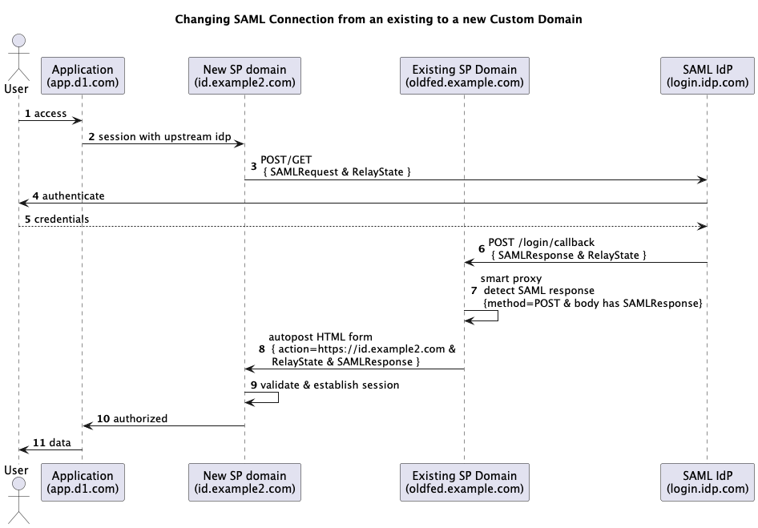

# Auth0 SAML Federation Connection Migration between Custom Domains

This project facilitates the migration of SAML federation from an existing Auth0 custom domain to a new one. It uses a Cloudflare Worker to intercept SAML responses and redirect them to the new domain, ensuring a smooth transition for users during the migration process.

## How It Works

The project sets up a "smart proxy" using a Cloudflare Worker that:

1. Intercepts SAML responses sent to the existing Auth0 custom domain
2. Creates an auto-submitting HTML form that redirects these responses to the new Auth0 custom domain
3. Proxies all other requests to the Auth0 edge location

This approach allows for a seamless migration without requiring immediate changes from the Identity Provider (IdP) side.

### Sequence Diagram

The following diagram illustrates the SAML federation migration workflow:



1. User accesses the application
2. Application redirects to the new SP domain for authentication
3. New SP domain sends SAML request to the Identity Provider
4. User authenticates with the Identity Provider
5. Identity Provider sends SAML response to the existing SP domain
6. Existing SP domain (with Cloudflare Worker) detects the SAML response
7. Worker creates an auto-submitting HTML form to redirect to the new SP domain
8. New SP domain validates the SAML response and establishes a session
9. Application is authorized, and user can access data

## Deployment

### Prerequisites

- Auth0 account with two tenants (one for Identity Provider, one for Service Provider)
- Cloudflare account with access to the domain used for Auth0 custom domains
- Terraform CLI installed
- Node.js and npm installed

### Deployment Steps

#### 1. Clone the Repository

```bash
git clone <repository-url>
cd auth0-mcd-federation-migration
```

#### 2. Install Dependencies

```bash
npm install
```

#### 3. Configure Terraform Variables

Create a `terraform.auto.tfvars` file in the `tf` directory with the following variables:

```hcl
# Auth0 Service Provider (SP) variables
auth0_domain = "your-sp-tenant.auth0.com"
auth0_existing_custom_domain = "oldfed.example.com"
auth0_new_custom_domain = "id.example2.com"
auth0_tf_client_id = "your-sp-client-id"
auth0_tf_client_secret = "your-sp-client-secret"

# Auth0 Identity Provider (IDP) variables
auth0_idp_domain = "your-idp-tenant.auth0.com"
auth0_idp_tf_client_id = "your-idp-client-id"
auth0_idp_tf_client_secret = "your-idp-client-secret"

# Cloudflare variables
cloudflare_api_key = "your-cloudflare-api-key"
cloudflare_email = "your-cloudflare-email"
cloudflare_zone_id = "your-cloudflare-zone-id"
```

#### 4. Initialize Terraform

```bash
cd tf
terraform init
```

#### 5. Apply Terraform Configuration

```bash
terraform apply
```

This will:

- Create a SAML-enabled application in the Identity Provider Auth0 tenant
- Create a SAML connection in the Service Provider Auth0 tenant
- Set up a custom domain in Auth0
- Configure DNS records in Cloudflare
- Generate the `.env` file with environment variables for the Cloudflare Worker

#### 6. Deploy the Cloudflare Worker

After Terraform has successfully applied the configuration, deploy the Cloudflare Worker:

```bash
cd ..
npx wrangler deploy
```

## Environment Variables

The Cloudflare Worker requires the following environment variables:

- `CNAME_API_KEY`: API key for the Auth0 custom domain
- `AUTH0_EDGE_LOCATION`: Hostname of the backend Auth0 edge location
- `NEW_SP_DOMAIN`: Domain for the new service provider where SAML responses should be redirected

These variables are automatically set in the `.env` file by Terraform.

## Testing

To test the SAML federation migration:

1. Configure a test application to use the new Auth0 custom domain
2. Attempt to log in through the SAML Identity Provider
3. Verify that the authentication flow completes successfully and redirects to the application

## Setting SAML Connection Destination and Recipient
Since SAML response payload is sent back to old SP location, it's normal to get destination and recipient mismatch error.

Use the script in the `bin/` folder to update connection's expected destination and audience:

```bash
cd bin/
export access_token='auth0-sp-tenant api2 access_token with `read:connections` and `update:connections` scope'

./sp-set-destination-url.sh -i saml-connection-id -d https://old-sp.address/login/callback
./sp-set-recipient-url.sh   -i saml-connection-id -r https://old-sp.address/login/callback
```

## Troubleshooting

If you encounter issues with the SAML responses not being redirected properly:

1. Check the Cloudflare Worker logs for any errors
2. Verify that the environment variables are set correctly
3. Ensure that the SAML configuration in both Auth0 tenants is correct
4. Check the DNS records in Cloudflare to ensure they are properly configured

## Demo Video
https://zoom.us/clips/share/CIcgpLtgTXegSvvM-jtW3w 

## License

This project is licensed under the MIT License - see the [LICENSE](LICENSE) file for details.

Copyright (c) 2015-current Auth0, Inc. <support@auth0.com> (http://auth0.com)
